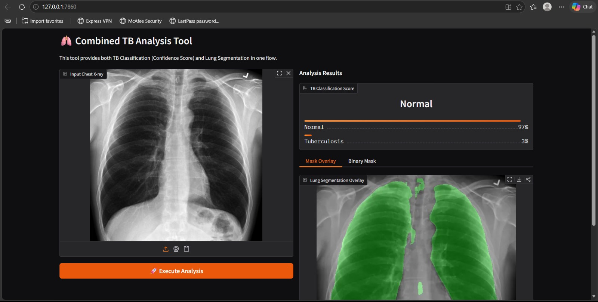
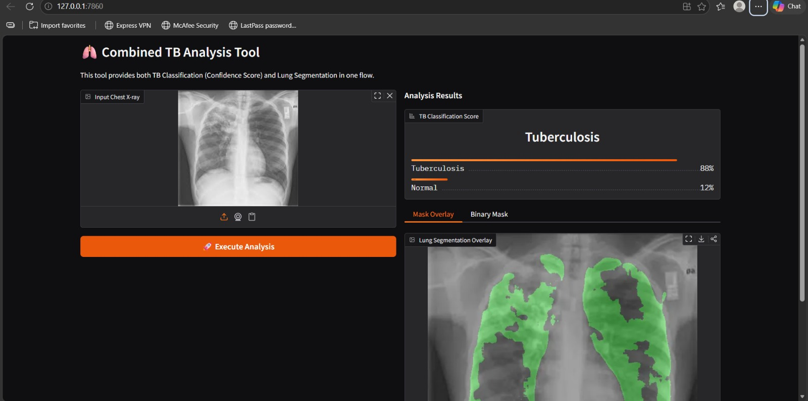

# Tuberculosis Detection & Lung Segmentation from Chest X-Ray

## Project Overview
Proyek ini mengintegrasikan dua model *deep learning* untuk analisis citra medis paru-paru:
1.  **TB Classification:** Mendeteksi kehadiran Tuberculosis menggunakan arsitektur **MobileNetV2**.
2.  **Lung Segmentation:** Mengisolasi area paru-paru dari citra X-ray menggunakan arsitektur **U-Net**.

Tantangan utama pada klasifikasi adalah ketidakseimbangan data (*imbalanced dataset*), yang ditangani menggunakan teknik *Class Weights*. Sedangkan untuk segmentasi, model dilatih untuk mengenali batas anatomi paru-paru secara presisi.

### Key Features:
- **Dual Inference Flow:** Analisis klasifikasi dan segmentasi dilakukan dalam satu pipeline.
- **TB Classifier:** Akurasi tinggi (>99%) dengan MobileNetV2.
- **Lung Segmentor:** Visualisasi area paru-paru menggunakan U-Net untuk membantu lokalisasi diagnostik.

---

## Tech Stack
- **Language:** Python
- **Libraries:** TensorFlow/Keras, Gradio, OpenCV, NumPy, Pillow.
- **Models:** MobileNetV2 (Classification), U-Net (Segmentation).

---

## Model Performance (Classification)
Hasil evaluasi pada **Test Set** (MobileNetV2):

| Class | Precision | Recall | F1-Score | Support |
| :--- | :--- | :--- | :--- | :--- |
| **Normal** | 0.99 | 1.00 | 0.99 | 350 |
| **TB** | 1.00 | 0.96 | 0.98 | 70 |
| **Accuracy** | | | **99.29%** | 420 |

---

## Detection Result with Lung Segmentation Visualization

  
  

*Catatan: Gambar di atas menunjukkan bagaimana model U-Net mengisolasi area paru-paru (Overlay Hijau) untuk memfokuskan analisis pada area yang relevan.*

---

## How to Run
Untuk menjalankan aplikasi testing secara lokal:

    pip install -r tests/requirements.txt
    python tests/test_app.py

Buka URL lokal yang muncul di terminal (biasanya `http://127.0.0.1:7860`).

---

## Dataset Reference
- [Tuberculosis (TB) Chest X-ray Database](https://www.kaggle.com/datasets/tawsifurrahman/tuberculosis-tb-chest-xray-dataset)
- [Chest X-Ray Lungs Segmentation](https://www.kaggle.com/datasets/iamtapendu/chest-x-ray-lungs-segmentation)
